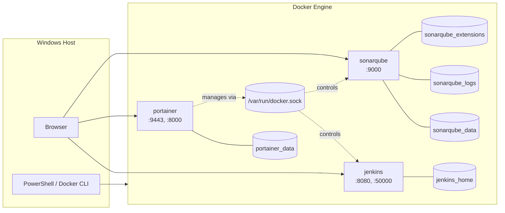

# Docker Project: Containerizing DevOps Tooling and Container Storage Persistence

## Overview

This project stands up fully containerized DevOps tooling, Jenkins, Portainer, and SonarQube, entirely through the Docker CLI, with no Docker Compose. The core focus is proving, not just configuring, storage persistence: every stateful service is backed by a named Docker volume, and each one is deliberately deleted and recreated mid-project to confirm its data survives independently of the container's lifecycle.

## Medium Article

A detailed Medium walkthrough documenting the complete build process, screenshots, troubleshooting, validation steps, engineering decisions, and lessons learned is available here:

[Building a Containerized DevOps Tooling with Jenkins, Portainer, and SonarQube, and Proving Container Storage Persistence](https://medium.com/@rester.mcglown/building-a-containerized-devops-tooling-with-jenkins-portainer-and-sonarqube-and-proving-eaa6137c67ff)

## Architecture



## Technologies Used

- Docker Desktop, Docker Engine, and CLI
- Jenkins (LTS) for CI orchestration
- Portainer Community Edition for container management
- SonarQube for static code analysis
- Docker named volumes for persistent storage
- Docker bind mount of the Docker socket
- Windows PowerShell
- Git and GitHub

## Project Objectives

The project objectives were to:

- Deploy Jenkins in a container with `JENKINS_HOME` persisted in a named volume
- Complete the Jenkins setup wizard and install the suggested plugin set
- Deploy Portainer with access to the host's Docker socket for container management
- Deploy SonarQube with three separate named volumes for its data, logs, and extensions
- Prove, through deliberate deletion and recreation, that both Jenkins and SonarQube retain their configuration, jobs, and user-created data independently of the container itself
- Use the Portainer UI to inspect running containers as an alternative to CLI-based inspection

## Repository Contents

```
docker-project-devops-tooling/
|-- README.md
`-- .gitignore
```

Screenshots documenting each phase are included in the accompanying Medium article rather than this repository.

## Business Scenario

ForgeWorks Software wants to trial Jenkins for continuous integration before committing to a dedicated server. The ask: stand up a working, persistent Jenkins instance entirely in containers, alongside supporting tooling for container management (Portainer) and code quality analysis (SonarQube), all without losing configuration or data if a container needs to be rebuilt.

## Phase 1: Jenkins with Persistent Storage

A named volume, `jenkins_home`, was created before the container itself, so Jenkins's data directory would exist independently of any container instance:

```bash
docker volume create jenkins_home
```

Jenkins was then launched detached, publishing both its web UI port (8080) and its JNLP agent port (50000), with the named volume mounted at `/var/jenkins_home`:

```bash
docker run -d -p 8080:8080 -p 50000:50000 --name jenkins -v jenkins_home:/var/jenkins_home jenkins/jenkins:lts
```

Jenkins's initial admin password is written to a file inside the container rather than displayed anywhere, so it was retrieved with `docker exec`:

```bash
docker exec jenkins cat /var/jenkins_home/secrets/initialAdminPassword
```

The suggested plugin set was installed during setup, and after creating an admin user, the setup wizard completed and the main dashboard loaded.

## Phase 2: Portainer for Container Management

Portainer was launched with two notable mounts: a named volume (`portainer_data`) for its own configuration, and a bind mount of the Docker socket (`/var/run/docker.sock`), which grants Portainer the ability to manage the host's Docker environment directly.

```bash
docker volume create portainer_data
docker run -d -p 8000:8000 -p 9443:9443 --name portainer --restart=always -v /var/run/docker.sock:/var/run/docker.sock -v portainer_data:/data portainer/portainer-ce:latest
```

Portainer's admin account has to be claimed within a short window of the container starting; on a first attempt this window closed before setup was reached, and Portainer permanently locked further setup attempts. Because that lockout state is written into the persistent volume rather than the container, restarting the container alone did not resolve it. The fix was to remove both the container and its volume and start clean, claiming the admin account immediately on the next attempt.

## Docker Socket Mount vs. Named Volume

The two mounts on the Portainer container serve entirely different purposes and are worth distinguishing clearly. `portainer_data` is a standard named volume: Docker-managed storage for Portainer's own configuration, decoupled from the container's lifecycle. The Docker socket mount is not a volume at all, it is a bind mount of a single host file that is the live interface every `docker` command uses to talk to the Docker Engine. Mounting it into a container hands that container the same control over the host as the Docker CLI itself.

## Phase 3: SonarQube with Multi-Volume Persistence

Three separate named volumes were created for SonarQube, corresponding to the three distinct paths it writes to internally: analysis data, logs, and installed plugins/extensions.

```bash
docker volume create sonarqube_data
docker volume create sonarqube_logs
docker volume create sonarqube_extensions

docker run -d -p 9000:9000 --name sonarqube -v sonarqube_data:/opt/sonarqube/data -v sonarqube_logs:/opt/sonarqube/logs -v sonarqube_extensions:/opt/sonarqube/extensions sonarqube:latest
```

After logging in with the default `admin`/`admin` credentials and completing the forced password change, two changes were made to establish a baseline for the persistence test: the Server Base URL was set to a custom value under General Settings, and a new user, `forgeworks-dev`, was created.

## Proving SonarQube Persistence

The SonarQube container was stopped and removed entirely, then recreated using the exact same command and the same three volumes:

```bash
docker stop sonarqube
docker rm sonarqube
docker run -d -p 9000:9000 --name sonarqube -v sonarqube_data:/opt/sonarqube/data -v sonarqube_logs:/opt/sonarqube/logs -v sonarqube_extensions:/opt/sonarqube/extensions sonarqube:latest
```

Logging back in, the custom Server Base URL and the `forgeworks-dev` user were both still present, confirming the data lived in the volumes and not in the deleted container.

## Phase 4: Jenkins Pipeline and Persistence Proof

A simple pipeline job, `forgeworks-ci-pipeline`, was created in Jenkins and run once to generate build history. The Jenkins container was then stopped, removed, and recreated using the identical original command:

```bash
docker stop jenkins
docker rm jenkins
docker run -d -p 8080:8080 -p 50000:50000 --name jenkins -v jenkins_home:/var/jenkins_home jenkins/jenkins:lts
```

On returning to `localhost:8080`, the unlock wizard and plugin installation did not reappear; a standard login prompt was presented instead, and logging in with the original admin credentials returned directly to the dashboard with `forgeworks-ci-pipeline` and its build history intact.

## Phase 5: Container Inspection via Portainer

Rather than using `docker ps` and `docker inspect` from the CLI, the running environment was inspected through the Portainer UI. The container list view showed Jenkins, SonarQube, and Portainer itself, all running, alongside published ports and creation times. Drilling into the Jenkins container's detail view surfaced its environment variables (including `JENKINS_HOME`), entrypoint, and port configuration, all through a browser-based interface rather than CLI output.

## Validation

Persistence was validated for both stateful services by deliberately destroying and rebuilding their containers, not by inspecting documentation or assuming volume behavior:

- **SonarQube:** a custom Server Base URL and a manually created user (`forgeworks-dev`) both survived a full container deletion and recreation.
- **Jenkins:** a pipeline job with build history, along with all installed plugins and the admin account, survived the same deletion-and-recreation process.

## Engineering Decisions

- **Named volumes over bind mounts for application state.** Named volumes were used for all three services' persistent data, since Docker manages their lifecycle independently of any host directory structure, which better reflects how these tools are run in production.
- **Splitting SonarQube's storage into three volumes.** Rather than a single volume for all of SonarQube's state, data, logs, and extensions were separated so that each could, in principle, be backed up, rotated, or migrated independently.
- **Publishing Jenkins's agent port up front.** Port 50000 wasn't used directly in this project, but was published from the start to avoid having to recreate the container later if a build agent needed to connect.
- **Choosing the SonarQube `latest` tag deliberately, after considering `sts`.** An initial attempt at the `sts` tag failed because it does not exist for this image; the tags page was checked directly rather than guessing again, and `latest` was chosen with the understanding that a production deployment would instead pin an explicit version number for reproducibility.

## Security and Operational Considerations

- **The Docker socket mount grants Portainer root-equivalent access to the host.** Mounting `/var/run/docker.sock` into a container is not the same as granting limited container-management permissions; it is functionally equivalent to root access on the host, since any container with that access can launch a new container that mounts the entire host filesystem. This mount should only ever be made to a trusted image.
- **Default credentials were changed immediately.** Both SonarQube's `admin`/`admin` default login and Jenkins's randomly generated initial password were replaced with unique credentials during setup rather than left in place.
- **Portainer's admin claim window is a deliberate security control.** The short window during which an admin account can be claimed exists specifically to prevent a race condition where an unauthorized party claims the account first; letting that window expire is a safe failure mode, not a bug.

## Lessons Learned

- A named volume decouples data from a container's lifecycle by storing it outside the container's writable layer entirely; deleting a container never touches the volume unless the volume is explicitly removed too.
- That same persistence works against you as easily as for you: Portainer's own "setup timed out" lockout state was written into its volume, meaning a container restart alone could not undo it. The volume itself had to be removed to get a clean slate.
- Not every documented CLI flag or tag exists as expected. The `docker volume create` and `docker run` commands were reliable, but assuming a tag name (`sts`) without checking the actual tags page produced an avoidable error.
- Multi-service storage isn't always one-size-fits-all: Jenkins needed a single volume, while SonarQube's image writes to three distinct internal paths, requiring three separate volumes to fully persist its state.

## How to Run the Project

```bash
# Jenkins
docker volume create jenkins_home
docker run -d -p 8080:8080 -p 50000:50000 --name jenkins -v jenkins_home:/var/jenkins_home jenkins/jenkins:lts

# Portainer
docker volume create portainer_data
docker run -d -p 8000:8000 -p 9443:9443 --name portainer --restart=always -v /var/run/docker.sock:/var/run/docker.sock -v portainer_data:/data portainer/portainer-ce:latest

# SonarQube
docker volume create sonarqube_data
docker volume create sonarqube_logs
docker volume create sonarqube_extensions
docker run -d -p 9000:9000 --name sonarqube -v sonarqube_data:/opt/sonarqube/data -v sonarqube_logs:/opt/sonarqube/logs -v sonarqube_extensions:/opt/sonarqube/extensions sonarqube:latest
```

Jenkins: `http://localhost:8080`
Portainer: `https://localhost:9443`
SonarQube: `http://localhost:9000`

## Future Improvements

A production version of this setup would introduce Docker Compose (or a full orchestrator) to manage all three services declaratively, add a reverse proxy with TLS in front of each web UI, restrict Portainer's Docker socket access behind a socket proxy rather than a direct mount, and configure Jenkins agents to connect over the already-published JNLP port for distributed builds.
